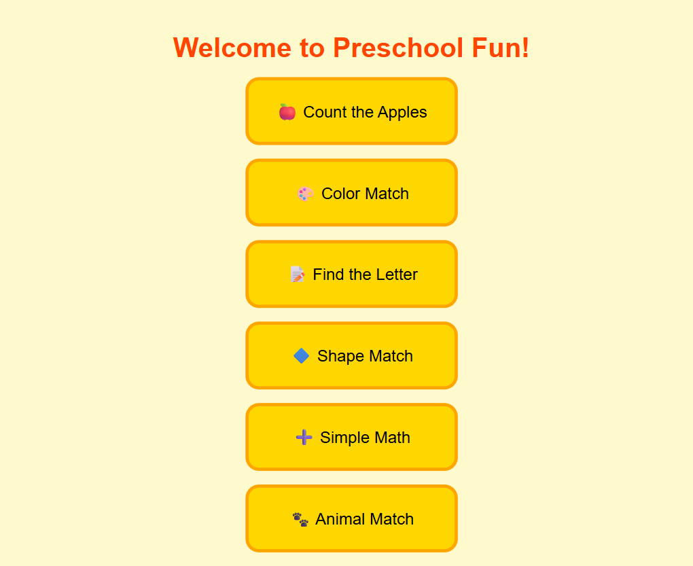

# Preschool Fun Games

An interactive browser-based educational game for preschoolers. Six mini-games help young children practise counting, colours, letters, shapes, basic arithmetic, and animal recognition — all playable with a single click, no installation required.

## Live Site

[https://sharrentoh-collab.github.io/claudeassessment/](https://sharrentoh-collab.github.io/claudeassessment/)



## Games

| Game | Description |
|---|---|
| 🍎 Count the Apples | Count the apples on a tree and pick the matching number (1–3) |
| 🎨 Color Match | Match the colour of a bucket by picking the correct coloured object |
| 📝 Find the Letter | Identify the displayed uppercase letter from three lowercase options |
| 🔷 Shape Match | Recognise a shape emoji and pick its name (circle, diamond, square, triangle, star) |
| ➕ Simple Math | Solve a simple addition problem (operands 1–3) and pick the right answer |
| 🐾 Animal Match | Identify an animal emoji from eight possible animals |

Correct answers trigger a bounce animation and confetti stars; wrong answers trigger a shake. Each correct answer immediately generates a new question.

## How to Run Locally

No build step required — open with any static HTTP server:

```bash
python -m http.server 8000
# or
npx serve
```

Then visit `http://localhost:8000`.

## Deployment

Pushing to `main` triggers the GitHub Actions workflow (`.github/workflows/deploy.yml`) which automatically publishes the site to GitHub Pages.

## Tech Stack

- Vanilla HTML, CSS, and JavaScript — no frameworks or dependencies
- Single-page app: `index.html`, `script.js`, `styles.css`
